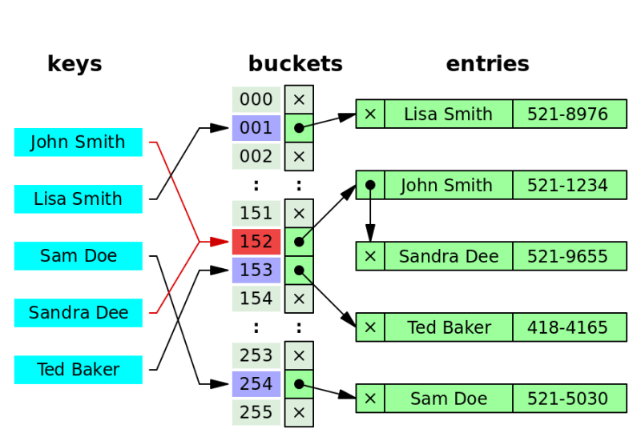

# Section 7 Hash Tables
Hash algorithm is idempotent

__How does hash table work?__

key > hash > index/address

There're are a lot hash function. The hash function for hash table should be very fast.

### Big O notations of Hash Tables Operations
* insert: O(1)
* access: O(1)
* delete: O(1)
* search: O(1)
* push: O(n)

__Pros__
* Fast lookups
* Fast insertion
* Flexible size

__Cons__
* Unordered
* Slow insertion in case of key collision.

#### Limitations of Hash Tables: Collision

A hash table collision occurs when two different keys hash to the same index in a hash table. Hash tables use a hash function to compute an index into an array of buckets or slots, from which the desired value can be found. Here’s a more detailed explanation:

1. __Hash Function__: A hash function takes an input (or 'key') and returns an integer, which is then used as an index in the hash table.
2. __Index Calculation__: This integer index is usually taken modulo the size of the array (hash table) to ensure it fits within the bounds of the array.
3. __Collision__: A collision occurs when two different keys produce the same index after being processed by the hash function. Since the hash table uses this index to store the value, it can only store one value at each index. Therefore, a method is needed to handle these collisions.

Collision impacts the operation speed.



### Insertion Order

### Sets

## Java Hash Tables

https://www.geeksforgeeks.org/map-interface-java-examples/

### Map Interface
https://docs.oracle.com/javase/8/docs/api/java/util/Map.html

### Abstract Map
https://docs.oracle.com/en/java/javase/17/docs/api/java.base/java/util/AbstractMap.html

#### HashMap
https://docs.oracle.com/en/java/javase/17/docs/api/java.base/java/util/HashMap.html

> An instance of HashMap has two parameters that affect its performance: initial capacity and load factor. The capacity is the number of buckets in the hash table, and the initial capacity is simply the capacity at the time the hash table is created. The load factor is a measure of how full the hash table is allowed to get before its capacity is automatically increased. When the number of entries in the hash table exceeds the product of the load factor and the current capacity, the hash table is rehashed (that is, internal data structures are rebuilt) so that the hash table has approximately twice the number of buckets.

##### Formula of initial capacity
capacity = max_entiries / load_factor

> As a general rule, the default load factor (.75) offers a good tradeoff between time and space costs.

##### HashMap vs Hashtable
https://www.geeksforgeeks.org/differences-between-hashmap-and-hashtable-in-java/

#### Collision
https://openjdk.org/jeps/180

Java's `HashMap` uses a combination of array and linked lists (or balanced trees in Java 8 and later) to handle hash collisions. Here's a detailed explanation of how `HashMap` resolves collisions:

#### 1. **Hashing and Buckets**

When you put an entry into a `HashMap`, the following steps occur:
1. The hash code of the key is calculated using the `hashCode()` method.
2. The hash code is then processed to produce an index in the internal array (called a bucket array) where the entry will be stored. This index is computed using bitwise operations to ensure a uniform distribution.

#### 2. **Handling Collisions with Linked Lists (Pre-Java 8)**

If two different keys produce the same index (i.e., they collide), the `HashMap` handles this by chaining the entries:
1. Each bucket in the array points to a linked list of entries.
2. If a collision occurs, the new entry is appended to the linked list at the corresponding bucket.

#### Example of Collision Resolution Using Linked Lists:
```java
HashMap<Integer, String> map = new HashMap<>();
map.put(1, "Value1");  // Suppose this hashes to bucket index 5
map.put(2, "Value2");  // Suppose this also hashes to bucket index 5 (collision)

// Internally, the bucket at index 5 now contains a linked list of entries:
// [Entry(key=1, value=Value1) -> Entry(key=2, value=Value2)]
```

#### 3. **Handling Collisions with Balanced Trees (Java 8 and Later)**

To improve performance for scenarios where many keys collide (resulting in long linked lists), Java 8 introduced the use of balanced trees (red-black trees):
1. When the number of entries in a bucket exceeds a certain threshold (by default, 8), the linked list is converted into a balanced tree.
2. This ensures that the time complexity for search operations remains efficient (O(log n)) even in the worst-case scenario.

#### Example of Collision Resolution Using Balanced Trees:
```java
// Assuming multiple entries have hashed to the same bucket and their count exceeds 8
// The linked list at the bucket index is converted to a balanced tree:
map.put(3, "Value3");  // Continues adding entries to the tree in bucket index 5

// Internally, the bucket at index 5 now contains a balanced tree:
```

#### 4. **Retrieving Entries**

When retrieving an entry from a `HashMap`:
1. The hash code of the key is used to find the correct bucket.
2. If the bucket contains a linked list, the list is traversed sequentially to find the matching key.
3. If the bucket contains a balanced tree, the tree is searched efficiently to find the matching key.

#### Summary

- **Hashing:** Converts a key to an index in the bucket array.
- **Chaining with Linked Lists:** Handles collisions by storing multiple entries in a linked list.
- **Balanced Trees (Java 8+):** Converts long linked lists to balanced trees to maintain efficient search times.
- **Retrieval:** Uses the hash code to find the bucket and then searches within the linked list or balanced tree.

This combination of techniques ensures that `HashMap` provides efficient storage and retrieval of entries, even when collisions occur.


## Reference
MD5 hash: https://www.miraclesalad.com/webtools/md5.php

Hash table animation: https://www.cs.usfca.edu/~galles/visualization/OpenHash.html

Wiki: https://en.wikipedia.org/wiki/Hash_table

Collision resolution: https://en.wikipedia.org/wiki/Hash_table#Collision_resolution

Compare hash tables of different programming languages:<br>
https://en.wikipedia.org/wiki/Comparison_of_programming_languages_(associative_array)#

